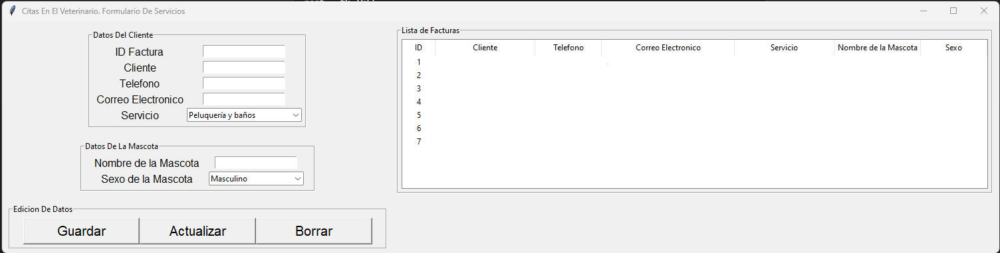

# VETERINARY APPOINTMENTS
## CRUD about Veterinary appointments
Desarrollar una app en Python con varios procesos en paralelos y explicar su código. (Los procesos pueden ser: Sistema de Facturación en el que puedan consultar datos de una BD y al mismo tiempo guardar la factura, actualizar el inventario, actualizar el balance del cliente y envio del reporte por correo electrónico (Este ejemplo ya no es valido, buscar una opción parecida)). Todos estos procesos se deben realizar en paralelos para usar la cpu.

## Tecnologias, Librerias, etc.
1. Python
* Descripción: El lenguaje de programación principal en el que está desarrollado el sistema.
* Uso: Todo el código está escrito en Python, aprovechando la estructura de clases, funciones y manejo de excepciones para la creación de una interfaz gráfica, conexión con bases de datos y otras funcionalidades.

2. Tkinter
* Descripción: Una librería estándar de Python para crear interfaces gráficas de usuario (GUI).
* Módulos de Tkinter utilizados:
* tkinter: Proporciona la funcionalidad básica de Tkinter para crear ventanas y widgets.
* ttk: Extiende la funcionalidad de tkinter para proporcionar widgets más avanzados.
* messagebox: Se utiliza para mostrar cuadros de diálogo como mensajes de información o advertencia.
* font: Permite trabajar con fuentes personalizadas para los textos.

* Uso: Se utiliza para crear toda la interfaz gráfica del formulario de la veterinaria, permitiendo al usuario ingresar datos sobre los clientes y mascotas, y visualizar facturas en un widget Treeview.

3. Resend
* Descripción: Un servicio de envío de correos electrónicos a través de una API, para enviar mensajes de confirmación a los clientes.
* Uso: Se emplea para enviar correos de confirmación a los clientes después de que se registran sus citas. En el código, la API de resend es usada mediante la importación del módulo resend y la utilización de la API Key desde las variables de entorno.

4. MySQL (mediante la clase CInvoices)
* Descripción: MySQL es una base de datos relacional, y en el código se usa una clase llamada CInvoices para gestionar las facturas y la interacción con la base de datos.
* Uso: Se utiliza para insertar, actualizar, eliminar y mostrar datos relacionados con los clientes, mascotas y servicios veterinarios en la base de datos.
* Conexión a la base de datos: Aunque el código relacionado con la conexión no se proporciona aquí, la clase CInvoices gestiona la interacción con MySQL para almacenar y recuperar los datos.

5. Módulo os
* Descripción: Un módulo estándar de Python para interactuar con el sistema operativo.
* Uso: Se utiliza para acceder a las variables de entorno, como la clave API de resend.

6. datetime
* Descripción: Un módulo estándar de Python para trabajar con fechas y horas.
* Uso: Se utiliza para obtener la fecha y hora actual al momento de guardar las citas y enviarlas en el correo de confirmación.

1. Imagen de portada.

